# 1. Khi chọn user số lượng là 1 thì RPS=7.1 ()

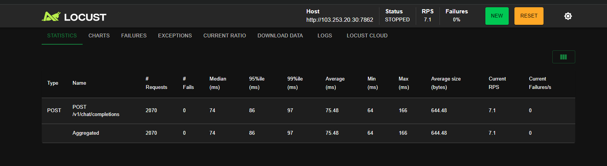

# 2. Khi chọn 40 user => Wait 1-3s thì RPS=19.2 = Số user / (respose time + wait time)

```
Users = 100
Response Time = 0.1s (100ms)
Wait Time = 2.0s (trung bình của 1-3s)

RPS = 100 / (0.1 + 2.0) = 100 / 2.1 ≈ 48 RPS
```


## 2.1

Khi chọn cùng là 40 user, WAIT TIME 1-3s
So với việc khi chọn 40 user, WAIT TIME 15-30s
thì kết quả RPS chắc chắn khác nhau, nếu thế thì lúc đó P95, P99 response time có giống nhau ko ??

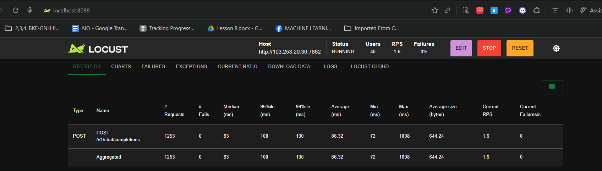

## 2.2 Khi chọn 80 user, wait time 1-3s , RPS 36.75, P95 = 220ms, P99 = 620ms

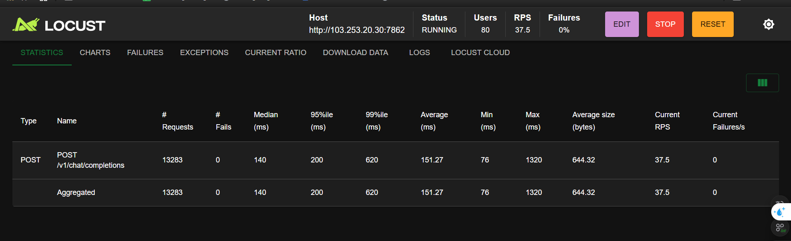

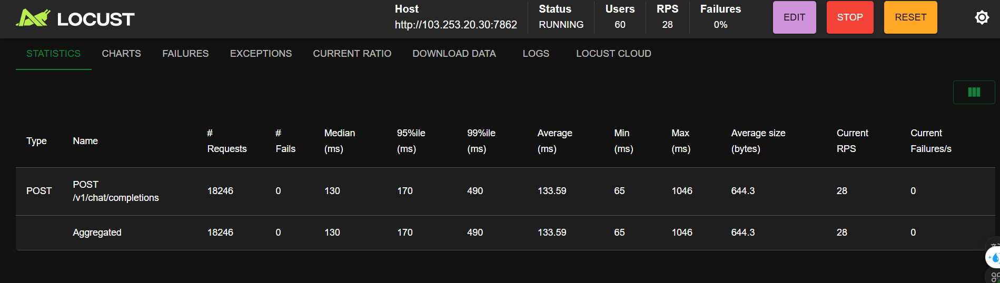

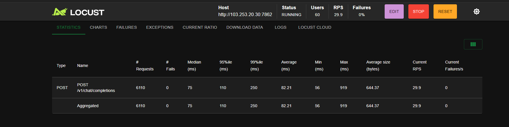

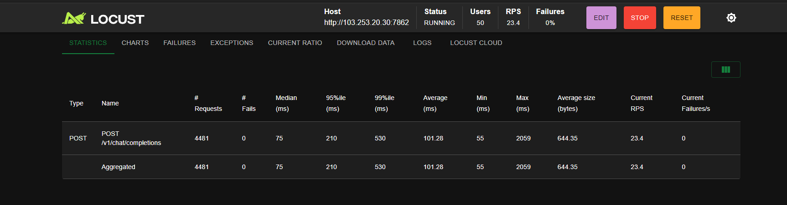

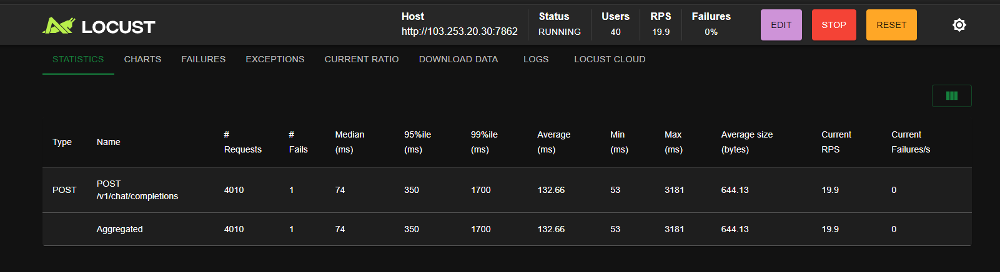

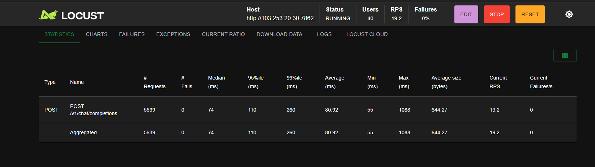

---

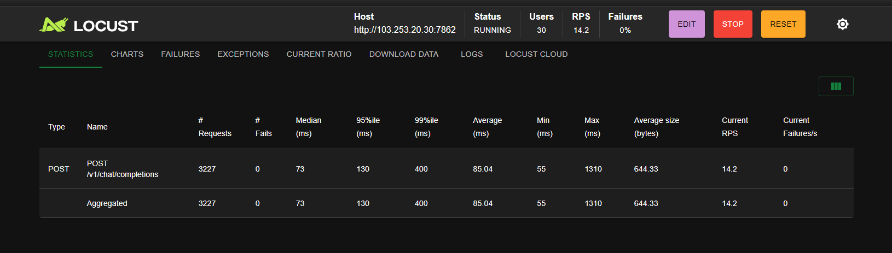

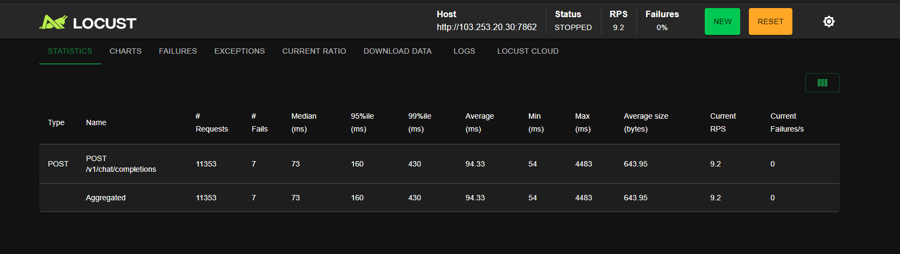

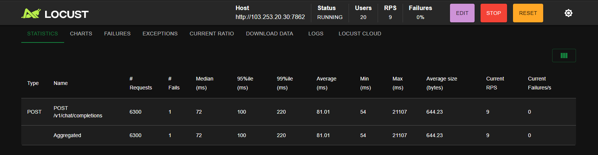


---


**Bảng tổng hợp Load Test - Endpoint `/v1/chat/completions`**

<pre class="font-ui border-border-100/50 overflow-x-scroll w-full rounded border-[0.5px] shadow-[0_2px_12px_hsl(var(--always-black)/5%)]"><table class="bg-bg-100 min-w-full border-separate border-spacing-0 text-sm leading-[1.88888] whitespace-normal"><thead class="text-left"><tr><th class="text-text-000 [&:not(:first-child)]:-x-[hsla(var(--border-100)/0.5)] px-2 [&:not(:first-child)]:border-l-[0.5px]">Test</th><th class="text-text-000 [&:not(:first-child)]:-x-[hsla(var(--border-100)/0.5)] px-2 [&:not(:first-child)]:border-l-[0.5px]">Users</th><th class="text-text-000 [&:not(:first-child)]:-x-[hsla(var(--border-100)/0.5)] px-2 [&:not(:first-child)]:border-l-[0.5px]">RPS</th><th class="text-text-000 [&:not(:first-child)]:-x-[hsla(var(--border-100)/0.5)] px-2 [&:not(:first-child)]:border-l-[0.5px]">Requests</th><th class="text-text-000 [&:not(:first-child)]:-x-[hsla(var(--border-100)/0.5)] px-2 [&:not(:first-child)]:border-l-[0.5px]">Fails</th><th class="text-text-000 [&:not(:first-child)]:-x-[hsla(var(--border-100)/0.5)] px-2 [&:not(:first-child)]:border-l-[0.5px]">Median (ms)</th><th class="text-text-000 [&:not(:first-child)]:-x-[hsla(var(--border-100)/0.5)] px-2 [&:not(:first-child)]:border-l-[0.5px]">95%ile (ms)</th><th class="text-text-000 [&:not(:first-child)]:-x-[hsla(var(--border-100)/0.5)] px-2 [&:not(:first-child)]:border-l-[0.5px]">99%ile (ms)</th><th class="text-text-000 [&:not(:first-child)]:-x-[hsla(var(--border-100)/0.5)] px-2 [&:not(:first-child)]:border-l-[0.5px]">Avg (ms)</th><th class="text-text-000 [&:not(:first-child)]:-x-[hsla(var(--border-100)/0.5)] px-2 [&:not(:first-child)]:border-l-[0.5px]">Min (ms)</th><th class="text-text-000 [&:not(:first-child)]:-x-[hsla(var(--border-100)/0.5)] px-2 [&:not(:first-child)]:border-l-[0.5px]">Max (ms)</th><th class="text-text-000 [&:not(:first-child)]:-x-[hsla(var(--border-100)/0.5)] px-2 [&:not(:first-child)]:border-l-[0.5px]">P99 ≤ 150ms</th></tr></thead><tbody><tr><td class="border-t-border-100/50 [&:not(:first-child)]:-x-[hsla(var(--border-100)/0.5)] border-t-[0.5px] px-2 [&:not(:first-child)]:border-l-[0.5px]">1</td><td class="border-t-border-100/50 [&:not(:first-child)]:-x-[hsla(var(--border-100)/0.5)] border-t-[0.5px] px-2 [&:not(:first-child)]:border-l-[0.5px]">-</td><td class="border-t-border-100/50 [&:not(:first-child)]:-x-[hsla(var(--border-100)/0.5)] border-t-[0.5px] px-2 [&:not(:first-child)]:border-l-[0.5px]">7.1</td><td class="border-t-border-100/50 [&:not(:first-child)]:-x-[hsla(var(--border-100)/0.5)] border-t-[0.5px] px-2 [&:not(:first-child)]:border-l-[0.5px]">2,070</td><td class="border-t-border-100/50 [&:not(:first-child)]:-x-[hsla(var(--border-100)/0.5)] border-t-[0.5px] px-2 [&:not(:first-child)]:border-l-[0.5px]">0</td><td class="border-t-border-100/50 [&:not(:first-child)]:-x-[hsla(var(--border-100)/0.5)] border-t-[0.5px] px-2 [&:not(:first-child)]:border-l-[0.5px]">74</td><td class="border-t-border-100/50 [&:not(:first-child)]:-x-[hsla(var(--border-100)/0.5)] border-t-[0.5px] px-2 [&:not(:first-child)]:border-l-[0.5px]">86</td><td class="border-t-border-100/50 [&:not(:first-child)]:-x-[hsla(var(--border-100)/0.5)] border-t-[0.5px] px-2 [&:not(:first-child)]:border-l-[0.5px]">97</td><td class="border-t-border-100/50 [&:not(:first-child)]:-x-[hsla(var(--border-100)/0.5)] border-t-[0.5px] px-2 [&:not(:first-child)]:border-l-[0.5px]">75.48</td><td class="border-t-border-100/50 [&:not(:first-child)]:-x-[hsla(var(--border-100)/0.5)] border-t-[0.5px] px-2 [&:not(:first-child)]:border-l-[0.5px]">64</td><td class="border-t-border-100/50 [&:not(:first-child)]:-x-[hsla(var(--border-100)/0.5)] border-t-[0.5px] px-2 [&:not(:first-child)]:border-l-[0.5px]">166</td><td class="border-t-border-100/50 [&:not(:first-child)]:-x-[hsla(var(--border-100)/0.5)] border-t-[0.5px] px-2 [&:not(:first-child)]:border-l-[0.5px]">✅</td></tr><tr><td class="border-t-border-100/50 [&:not(:first-child)]:-x-[hsla(var(--border-100)/0.5)] border-t-[0.5px] px-2 [&:not(:first-child)]:border-l-[0.5px]">2</td><td class="border-t-border-100/50 [&:not(:first-child)]:-x-[hsla(var(--border-100)/0.5)] border-t-[0.5px] px-2 [&:not(:first-child)]:border-l-[0.5px]">20</td><td class="border-t-border-100/50 [&:not(:first-child)]:-x-[hsla(var(--border-100)/0.5)] border-t-[0.5px] px-2 [&:not(:first-child)]:border-l-[0.5px]">9.2</td><td class="border-t-border-100/50 [&:not(:first-child)]:-x-[hsla(var(--border-100)/0.5)] border-t-[0.5px] px-2 [&:not(:first-child)]:border-l-[0.5px]">11,353</td><td class="border-t-border-100/50 [&:not(:first-child)]:-x-[hsla(var(--border-100)/0.5)] border-t-[0.5px] px-2 [&:not(:first-child)]:border-l-[0.5px]">7</td><td class="border-t-border-100/50 [&:not(:first-child)]:-x-[hsla(var(--border-100)/0.5)] border-t-[0.5px] px-2 [&:not(:first-child)]:border-l-[0.5px]">73</td><td class="border-t-border-100/50 [&:not(:first-child)]:-x-[hsla(var(--border-100)/0.5)] border-t-[0.5px] px-2 [&:not(:first-child)]:border-l-[0.5px]">160</td><td class="border-t-border-100/50 [&:not(:first-child)]:-x-[hsla(var(--border-100)/0.5)] border-t-[0.5px] px-2 [&:not(:first-child)]:border-l-[0.5px]">430</td><td class="border-t-border-100/50 [&:not(:first-child)]:-x-[hsla(var(--border-100)/0.5)] border-t-[0.5px] px-2 [&:not(:first-child)]:border-l-[0.5px]">94.33</td><td class="border-t-border-100/50 [&:not(:first-child)]:-x-[hsla(var(--border-100)/0.5)] border-t-[0.5px] px-2 [&:not(:first-child)]:border-l-[0.5px]">54</td><td class="border-t-border-100/50 [&:not(:first-child)]:-x-[hsla(var(--border-100)/0.5)] border-t-[0.5px] px-2 [&:not(:first-child)]:border-l-[0.5px]">4,483</td><td class="border-t-border-100/50 [&:not(:first-child)]:-x-[hsla(var(--border-100)/0.5)] border-t-[0.5px] px-2 [&:not(:first-child)]:border-l-[0.5px]">❌</td></tr><tr><td class="border-t-border-100/50 [&:not(:first-child)]:-x-[hsla(var(--border-100)/0.5)] border-t-[0.5px] px-2 [&:not(:first-child)]:border-l-[0.5px]">3</td><td class="border-t-border-100/50 [&:not(:first-child)]:-x-[hsla(var(--border-100)/0.5)] border-t-[0.5px] px-2 [&:not(:first-child)]:border-l-[0.5px]">20</td><td class="border-t-border-100/50 [&:not(:first-child)]:-x-[hsla(var(--border-100)/0.5)] border-t-[0.5px] px-2 [&:not(:first-child)]:border-l-[0.5px]">9.3</td><td class="border-t-border-100/50 [&:not(:first-child)]:-x-[hsla(var(--border-100)/0.5)] border-t-[0.5px] px-2 [&:not(:first-child)]:border-l-[0.5px]">6,102</td><td class="border-t-border-100/50 [&:not(:first-child)]:-x-[hsla(var(--border-100)/0.5)] border-t-[0.5px] px-2 [&:not(:first-child)]:border-l-[0.5px]">0</td><td class="border-t-border-100/50 [&:not(:first-child)]:-x-[hsla(var(--border-100)/0.5)] border-t-[0.5px] px-2 [&:not(:first-child)]:border-l-[0.5px]">73</td><td class="border-t-border-100/50 [&:not(:first-child)]:-x-[hsla(var(--border-100)/0.5)] border-t-[0.5px] px-2 [&:not(:first-child)]:border-l-[0.5px]">170</td><td class="border-t-border-100/50 [&:not(:first-child)]:-x-[hsla(var(--border-100)/0.5)] border-t-[0.5px] px-2 [&:not(:first-child)]:border-l-[0.5px]">360</td><td class="border-t-border-100/50 [&:not(:first-child)]:-x-[hsla(var(--border-100)/0.5)] border-t-[0.5px] px-2 [&:not(:first-child)]:border-l-[0.5px]">89.04</td><td class="border-t-border-100/50 [&:not(:first-child)]:-x-[hsla(var(--border-100)/0.5)] border-t-[0.5px] px-2 [&:not(:first-child)]:border-l-[0.5px]">54</td><td class="border-t-border-100/50 [&:not(:first-child)]:-x-[hsla(var(--border-100)/0.5)] border-t-[0.5px] px-2 [&:not(:first-child)]:border-l-[0.5px]">4,382</td><td class="border-t-border-100/50 [&:not(:first-child)]:-x-[hsla(var(--border-100)/0.5)] border-t-[0.5px] px-2 [&:not(:first-child)]:border-l-[0.5px]">❌</td></tr><tr><td class="border-t-border-100/50 [&:not(:first-child)]:-x-[hsla(var(--border-100)/0.5)] border-t-[0.5px] px-2 [&:not(:first-child)]:border-l-[0.5px]">4</td><td class="border-t-border-100/50 [&:not(:first-child)]:-x-[hsla(var(--border-100)/0.5)] border-t-[0.5px] px-2 [&:not(:first-child)]:border-l-[0.5px]">20</td><td class="border-t-border-100/50 [&:not(:first-child)]:-x-[hsla(var(--border-100)/0.5)] border-t-[0.5px] px-2 [&:not(:first-child)]:border-l-[0.5px]">9</td><td class="border-t-border-100/50 [&:not(:first-child)]:-x-[hsla(var(--border-100)/0.5)] border-t-[0.5px] px-2 [&:not(:first-child)]:border-l-[0.5px]">6,300</td><td class="border-t-border-100/50 [&:not(:first-child)]:-x-[hsla(var(--border-100)/0.5)] border-t-[0.5px] px-2 [&:not(:first-child)]:border-l-[0.5px]">1</td><td class="border-t-border-100/50 [&:not(:first-child)]:-x-[hsla(var(--border-100)/0.5)] border-t-[0.5px] px-2 [&:not(:first-child)]:border-l-[0.5px]">72</td><td class="border-t-border-100/50 [&:not(:first-child)]:-x-[hsla(var(--border-100)/0.5)] border-t-[0.5px] px-2 [&:not(:first-child)]:border-l-[0.5px]">100</td><td class="border-t-border-100/50 [&:not(:first-child)]:-x-[hsla(var(--border-100)/0.5)] border-t-[0.5px] px-2 [&:not(:first-child)]:border-l-[0.5px]">220</td><td class="border-t-border-100/50 [&:not(:first-child)]:-x-[hsla(var(--border-100)/0.5)] border-t-[0.5px] px-2 [&:not(:first-child)]:border-l-[0.5px]">81.01</td><td class="border-t-border-100/50 [&:not(:first-child)]:-x-[hsla(var(--border-100)/0.5)] border-t-[0.5px] px-2 [&:not(:first-child)]:border-l-[0.5px]">54</td><td class="border-t-border-100/50 [&:not(:first-child)]:-x-[hsla(var(--border-100)/0.5)] border-t-[0.5px] px-2 [&:not(:first-child)]:border-l-[0.5px]">21,107</td><td class="border-t-border-100/50 [&:not(:first-child)]:-x-[hsla(var(--border-100)/0.5)] border-t-[0.5px] px-2 [&:not(:first-child)]:border-l-[0.5px]">❌</td></tr><tr><td class="border-t-border-100/50 [&:not(:first-child)]:-x-[hsla(var(--border-100)/0.5)] border-t-[0.5px] px-2 [&:not(:first-child)]:border-l-[0.5px]">5</td><td class="border-t-border-100/50 [&:not(:first-child)]:-x-[hsla(var(--border-100)/0.5)] border-t-[0.5px] px-2 [&:not(:first-child)]:border-l-[0.5px]">30</td><td class="border-t-border-100/50 [&:not(:first-child)]:-x-[hsla(var(--border-100)/0.5)] border-t-[0.5px] px-2 [&:not(:first-child)]:border-l-[0.5px]">14.2</td><td class="border-t-border-100/50 [&:not(:first-child)]:-x-[hsla(var(--border-100)/0.5)] border-t-[0.5px] px-2 [&:not(:first-child)]:border-l-[0.5px]">3,227</td><td class="border-t-border-100/50 [&:not(:first-child)]:-x-[hsla(var(--border-100)/0.5)] border-t-[0.5px] px-2 [&:not(:first-child)]:border-l-[0.5px]">0</td><td class="border-t-border-100/50 [&:not(:first-child)]:-x-[hsla(var(--border-100)/0.5)] border-t-[0.5px] px-2 [&:not(:first-child)]:border-l-[0.5px]">73</td><td class="border-t-border-100/50 [&:not(:first-child)]:-x-[hsla(var(--border-100)/0.5)] border-t-[0.5px] px-2 [&:not(:first-child)]:border-l-[0.5px]">130</td><td class="border-t-border-100/50 [&:not(:first-child)]:-x-[hsla(var(--border-100)/0.5)] border-t-[0.5px] px-2 [&:not(:first-child)]:border-l-[0.5px]">400</td><td class="border-t-border-100/50 [&:not(:first-child)]:-x-[hsla(var(--border-100)/0.5)] border-t-[0.5px] px-2 [&:not(:first-child)]:border-l-[0.5px]">85.04</td><td class="border-t-border-100/50 [&:not(:first-child)]:-x-[hsla(var(--border-100)/0.5)] border-t-[0.5px] px-2 [&:not(:first-child)]:border-l-[0.5px]">55</td><td class="border-t-border-100/50 [&:not(:first-child)]:-x-[hsla(var(--border-100)/0.5)] border-t-[0.5px] px-2 [&:not(:first-child)]:border-l-[0.5px]">1,310</td><td class="border-t-border-100/50 [&:not(:first-child)]:-x-[hsla(var(--border-100)/0.5)] border-t-[0.5px] px-2 [&:not(:first-child)]:border-l-[0.5px]">❌</td></tr><tr><td class="border-t-border-100/50 [&:not(:first-child)]:-x-[hsla(var(--border-100)/0.5)] border-t-[0.5px] px-2 [&:not(:first-child)]:border-l-[0.5px]">6</td><td class="border-t-border-100/50 [&:not(:first-child)]:-x-[hsla(var(--border-100)/0.5)] border-t-[0.5px] px-2 [&:not(:first-child)]:border-l-[0.5px]">40</td><td class="border-t-border-100/50 [&:not(:first-child)]:-x-[hsla(var(--border-100)/0.5)] border-t-[0.5px] px-2 [&:not(:first-child)]:border-l-[0.5px]">1.6</td><td class="border-t-border-100/50 [&:not(:first-child)]:-x-[hsla(var(--border-100)/0.5)] border-t-[0.5px] px-2 [&:not(:first-child)]:border-l-[0.5px]">1,253</td><td class="border-t-border-100/50 [&:not(:first-child)]:-x-[hsla(var(--border-100)/0.5)] border-t-[0.5px] px-2 [&:not(:first-child)]:border-l-[0.5px]">0</td><td class="border-t-border-100/50 [&:not(:first-child)]:-x-[hsla(var(--border-100)/0.5)] border-t-[0.5px] px-2 [&:not(:first-child)]:border-l-[0.5px]">83</td><td class="border-t-border-100/50 [&:not(:first-child)]:-x-[hsla(var(--border-100)/0.5)] border-t-[0.5px] px-2 [&:not(:first-child)]:border-l-[0.5px]">100</td><td class="border-t-border-100/50 [&:not(:first-child)]:-x-[hsla(var(--border-100)/0.5)] border-t-[0.5px] px-2 [&:not(:first-child)]:border-l-[0.5px]">130</td><td class="border-t-border-100/50 [&:not(:first-child)]:-x-[hsla(var(--border-100)/0.5)] border-t-[0.5px] px-2 [&:not(:first-child)]:border-l-[0.5px]">86.32</td><td class="border-t-border-100/50 [&:not(:first-child)]:-x-[hsla(var(--border-100)/0.5)] border-t-[0.5px] px-2 [&:not(:first-child)]:border-l-[0.5px]">72</td><td class="border-t-border-100/50 [&:not(:first-child)]:-x-[hsla(var(--border-100)/0.5)] border-t-[0.5px] px-2 [&:not(:first-child)]:border-l-[0.5px]">1,098</td><td class="border-t-border-100/50 [&:not(:first-child)]:-x-[hsla(var(--border-100)/0.5)] border-t-[0.5px] px-2 [&:not(:first-child)]:border-l-[0.5px]">✅</td></tr><tr><td class="border-t-border-100/50 [&:not(:first-child)]:-x-[hsla(var(--border-100)/0.5)] border-t-[0.5px] px-2 [&:not(:first-child)]:border-l-[0.5px]">7</td><td class="border-t-border-100/50 [&:not(:first-child)]:-x-[hsla(var(--border-100)/0.5)] border-t-[0.5px] px-2 [&:not(:first-child)]:border-l-[0.5px]">40</td><td class="border-t-border-100/50 [&:not(:first-child)]:-x-[hsla(var(--border-100)/0.5)] border-t-[0.5px] px-2 [&:not(:first-child)]:border-l-[0.5px]">19.2</td><td class="border-t-border-100/50 [&:not(:first-child)]:-x-[hsla(var(--border-100)/0.5)] border-t-[0.5px] px-2 [&:not(:first-child)]:border-l-[0.5px]">6,055</td><td class="border-t-border-100/50 [&:not(:first-child)]:-x-[hsla(var(--border-100)/0.5)] border-t-[0.5px] px-2 [&:not(:first-child)]:border-l-[0.5px]">0</td><td class="border-t-border-100/50 [&:not(:first-child)]:-x-[hsla(var(--border-100)/0.5)] border-t-[0.5px] px-2 [&:not(:first-child)]:border-l-[0.5px]">85</td><td class="border-t-border-100/50 [&:not(:first-child)]:-x-[hsla(var(--border-100)/0.5)] border-t-[0.5px] px-2 [&:not(:first-child)]:border-l-[0.5px]">110</td><td class="border-t-border-100/50 [&:not(:first-child)]:-x-[hsla(var(--border-100)/0.5)] border-t-[0.5px] px-2 [&:not(:first-child)]:border-l-[0.5px]">130</td><td class="border-t-border-100/50 [&:not(:first-child)]:-x-[hsla(var(--border-100)/0.5)] border-t-[0.5px] px-2 [&:not(:first-child)]:border-l-[0.5px]">87.69</td><td class="border-t-border-100/50 [&:not(:first-child)]:-x-[hsla(var(--border-100)/0.5)] border-t-[0.5px] px-2 [&:not(:first-child)]:border-l-[0.5px]">61</td><td class="border-t-border-100/50 [&:not(:first-child)]:-x-[hsla(var(--border-100)/0.5)] border-t-[0.5px] px-2 [&:not(:first-child)]:border-l-[0.5px]">202</td><td class="border-t-border-100/50 [&:not(:first-child)]:-x-[hsla(var(--border-100)/0.5)] border-t-[0.5px] px-2 [&:not(:first-child)]:border-l-[0.5px]">✅</td></tr><tr><td class="border-t-border-100/50 [&:not(:first-child)]:-x-[hsla(var(--border-100)/0.5)] border-t-[0.5px] px-2 [&:not(:first-child)]:border-l-[0.5px]">8</td><td class="border-t-border-100/50 [&:not(:first-child)]:-x-[hsla(var(--border-100)/0.5)] border-t-[0.5px] px-2 [&:not(:first-child)]:border-l-[0.5px]">40</td><td class="border-t-border-100/50 [&:not(:first-child)]:-x-[hsla(var(--border-100)/0.5)] border-t-[0.5px] px-2 [&:not(:first-child)]:border-l-[0.5px]">19.2</td><td class="border-t-border-100/50 [&:not(:first-child)]:-x-[hsla(var(--border-100)/0.5)] border-t-[0.5px] px-2 [&:not(:first-child)]:border-l-[0.5px]">5,639</td><td class="border-t-border-100/50 [&:not(:first-child)]:-x-[hsla(var(--border-100)/0.5)] border-t-[0.5px] px-2 [&:not(:first-child)]:border-l-[0.5px]">0</td><td class="border-t-border-100/50 [&:not(:first-child)]:-x-[hsla(var(--border-100)/0.5)] border-t-[0.5px] px-2 [&:not(:first-child)]:border-l-[0.5px]">74</td><td class="border-t-border-100/50 [&:not(:first-child)]:-x-[hsla(var(--border-100)/0.5)] border-t-[0.5px] px-2 [&:not(:first-child)]:border-l-[0.5px]">110</td><td class="border-t-border-100/50 [&:not(:first-child)]:-x-[hsla(var(--border-100)/0.5)] border-t-[0.5px] px-2 [&:not(:first-child)]:border-l-[0.5px]">260</td><td class="border-t-border-100/50 [&:not(:first-child)]:-x-[hsla(var(--border-100)/0.5)] border-t-[0.5px] px-2 [&:not(:first-child)]:border-l-[0.5px]">80.92</td><td class="border-t-border-100/50 [&:not(:first-child)]:-x-[hsla(var(--border-100)/0.5)] border-t-[0.5px] px-2 [&:not(:first-child)]:border-l-[0.5px]">55</td><td class="border-t-border-100/50 [&:not(:first-child)]:-x-[hsla(var(--border-100)/0.5)] border-t-[0.5px] px-2 [&:not(:first-child)]:border-l-[0.5px]">1,088</td><td class="border-t-border-100/50 [&:not(:first-child)]:-x-[hsla(var(--border-100)/0.5)] border-t-[0.5px] px-2 [&:not(:first-child)]:border-l-[0.5px]">❌</td></tr><tr><td class="border-t-border-100/50 [&:not(:first-child)]:-x-[hsla(var(--border-100)/0.5)] border-t-[0.5px] px-2 [&:not(:first-child)]:border-l-[0.5px]">9</td><td class="border-t-border-100/50 [&:not(:first-child)]:-x-[hsla(var(--border-100)/0.5)] border-t-[0.5px] px-2 [&:not(:first-child)]:border-l-[0.5px]">40</td><td class="border-t-border-100/50 [&:not(:first-child)]:-x-[hsla(var(--border-100)/0.5)] border-t-[0.5px] px-2 [&:not(:first-child)]:border-l-[0.5px]">19.9</td><td class="border-t-border-100/50 [&:not(:first-child)]:-x-[hsla(var(--border-100)/0.5)] border-t-[0.5px] px-2 [&:not(:first-child)]:border-l-[0.5px]">4,010</td><td class="border-t-border-100/50 [&:not(:first-child)]:-x-[hsla(var(--border-100)/0.5)] border-t-[0.5px] px-2 [&:not(:first-child)]:border-l-[0.5px]">1</td><td class="border-t-border-100/50 [&:not(:first-child)]:-x-[hsla(var(--border-100)/0.5)] border-t-[0.5px] px-2 [&:not(:first-child)]:border-l-[0.5px]">74</td><td class="border-t-border-100/50 [&:not(:first-child)]:-x-[hsla(var(--border-100)/0.5)] border-t-[0.5px] px-2 [&:not(:first-child)]:border-l-[0.5px]">350</td><td class="border-t-border-100/50 [&:not(:first-child)]:-x-[hsla(var(--border-100)/0.5)] border-t-[0.5px] px-2 [&:not(:first-child)]:border-l-[0.5px]">1,700</td><td class="border-t-border-100/50 [&:not(:first-child)]:-x-[hsla(var(--border-100)/0.5)] border-t-[0.5px] px-2 [&:not(:first-child)]:border-l-[0.5px]">132.66</td><td class="border-t-border-100/50 [&:not(:first-child)]:-x-[hsla(var(--border-100)/0.5)] border-t-[0.5px] px-2 [&:not(:first-child)]:border-l-[0.5px]">53</td><td class="border-t-border-100/50 [&:not(:first-child)]:-x-[hsla(var(--border-100)/0.5)] border-t-[0.5px] px-2 [&:not(:first-child)]:border-l-[0.5px]">3,181</td><td class="border-t-border-100/50 [&:not(:first-child)]:-x-[hsla(var(--border-100)/0.5)] border-t-[0.5px] px-2 [&:not(:first-child)]:border-l-[0.5px]">❌</td></tr><tr><td class="border-t-border-100/50 [&:not(:first-child)]:-x-[hsla(var(--border-100)/0.5)] border-t-[0.5px] px-2 [&:not(:first-child)]:border-l-[0.5px]">10</td><td class="border-t-border-100/50 [&:not(:first-child)]:-x-[hsla(var(--border-100)/0.5)] border-t-[0.5px] px-2 [&:not(:first-child)]:border-l-[0.5px]">50</td><td class="border-t-border-100/50 [&:not(:first-child)]:-x-[hsla(var(--border-100)/0.5)] border-t-[0.5px] px-2 [&:not(:first-child)]:border-l-[0.5px]">23.4</td><td class="border-t-border-100/50 [&:not(:first-child)]:-x-[hsla(var(--border-100)/0.5)] border-t-[0.5px] px-2 [&:not(:first-child)]:border-l-[0.5px]">4,481</td><td class="border-t-border-100/50 [&:not(:first-child)]:-x-[hsla(var(--border-100)/0.5)] border-t-[0.5px] px-2 [&:not(:first-child)]:border-l-[0.5px]">0</td><td class="border-t-border-100/50 [&:not(:first-child)]:-x-[hsla(var(--border-100)/0.5)] border-t-[0.5px] px-2 [&:not(:first-child)]:border-l-[0.5px]">75</td><td class="border-t-border-100/50 [&:not(:first-child)]:-x-[hsla(var(--border-100)/0.5)] border-t-[0.5px] px-2 [&:not(:first-child)]:border-l-[0.5px]">210</td><td class="border-t-border-100/50 [&:not(:first-child)]:-x-[hsla(var(--border-100)/0.5)] border-t-[0.5px] px-2 [&:not(:first-child)]:border-l-[0.5px]">530</td><td class="border-t-border-100/50 [&:not(:first-child)]:-x-[hsla(var(--border-100)/0.5)] border-t-[0.5px] px-2 [&:not(:first-child)]:border-l-[0.5px]">101.28</td><td class="border-t-border-100/50 [&:not(:first-child)]:-x-[hsla(var(--border-100)/0.5)] border-t-[0.5px] px-2 [&:not(:first-child)]:border-l-[0.5px]">55</td><td class="border-t-border-100/50 [&:not(:first-child)]:-x-[hsla(var(--border-100)/0.5)] border-t-[0.5px] px-2 [&:not(:first-child)]:border-l-[0.5px]">2,059</td><td class="border-t-border-100/50 [&:not(:first-child)]:-x-[hsla(var(--border-100)/0.5)] border-t-[0.5px] px-2 [&:not(:first-child)]:border-l-[0.5px]">❌</td></tr><tr><td class="border-t-border-100/50 [&:not(:first-child)]:-x-[hsla(var(--border-100)/0.5)] border-t-[0.5px] px-2 [&:not(:first-child)]:border-l-[0.5px]">11</td><td class="border-t-border-100/50 [&:not(:first-child)]:-x-[hsla(var(--border-100)/0.5)] border-t-[0.5px] px-2 [&:not(:first-child)]:border-l-[0.5px]">60</td><td class="border-t-border-100/50 [&:not(:first-child)]:-x-[hsla(var(--border-100)/0.5)] border-t-[0.5px] px-2 [&:not(:first-child)]:border-l-[0.5px]">29.9</td><td class="border-t-border-100/50 [&:not(:first-child)]:-x-[hsla(var(--border-100)/0.5)] border-t-[0.5px] px-2 [&:not(:first-child)]:border-l-[0.5px]">6,110</td><td class="border-t-border-100/50 [&:not(:first-child)]:-x-[hsla(var(--border-100)/0.5)] border-t-[0.5px] px-2 [&:not(:first-child)]:border-l-[0.5px]">0</td><td class="border-t-border-100/50 [&:not(:first-child)]:-x-[hsla(var(--border-100)/0.5)] border-t-[0.5px] px-2 [&:not(:first-child)]:border-l-[0.5px]">75</td><td class="border-t-border-100/50 [&:not(:first-child)]:-x-[hsla(var(--border-100)/0.5)] border-t-[0.5px] px-2 [&:not(:first-child)]:border-l-[0.5px]">110</td><td class="border-t-border-100/50 [&:not(:first-child)]:-x-[hsla(var(--border-100)/0.5)] border-t-[0.5px] px-2 [&:not(:first-child)]:border-l-[0.5px]">250</td><td class="border-t-border-100/50 [&:not(:first-child)]:-x-[hsla(var(--border-100)/0.5)] border-t-[0.5px] px-2 [&:not(:first-child)]:border-l-[0.5px]">82.21</td><td class="border-t-border-100/50 [&:not(:first-child)]:-x-[hsla(var(--border-100)/0.5)] border-t-[0.5px] px-2 [&:not(:first-child)]:border-l-[0.5px]">56</td><td class="border-t-border-100/50 [&:not(:first-child)]:-x-[hsla(var(--border-100)/0.5)] border-t-[0.5px] px-2 [&:not(:first-child)]:border-l-[0.5px]">919</td><td class="border-t-border-100/50 [&:not(:first-child)]:-x-[hsla(var(--border-100)/0.5)] border-t-[0.5px] px-2 [&:not(:first-child)]:border-l-[0.5px]">❌</td></tr><tr><td class="border-t-border-100/50 [&:not(:first-child)]:-x-[hsla(var(--border-100)/0.5)] border-t-[0.5px] px-2 [&:not(:first-child)]:border-l-[0.5px]">12</td><td class="border-t-border-100/50 [&:not(:first-child)]:-x-[hsla(var(--border-100)/0.5)] border-t-[0.5px] px-2 [&:not(:first-child)]:border-l-[0.5px]">60</td><td class="border-t-border-100/50 [&:not(:first-child)]:-x-[hsla(var(--border-100)/0.5)] border-t-[0.5px] px-2 [&:not(:first-child)]:border-l-[0.5px]">28</td><td class="border-t-border-100/50 [&:not(:first-child)]:-x-[hsla(var(--border-100)/0.5)] border-t-[0.5px] px-2 [&:not(:first-child)]:border-l-[0.5px]">18,246</td><td class="border-t-border-100/50 [&:not(:first-child)]:-x-[hsla(var(--border-100)/0.5)] border-t-[0.5px] px-2 [&:not(:first-child)]:border-l-[0.5px]">0</td><td class="border-t-border-100/50 [&:not(:first-child)]:-x-[hsla(var(--border-100)/0.5)] border-t-[0.5px] px-2 [&:not(:first-child)]:border-l-[0.5px]">130</td><td class="border-t-border-100/50 [&:not(:first-child)]:-x-[hsla(var(--border-100)/0.5)] border-t-[0.5px] px-2 [&:not(:first-child)]:border-l-[0.5px]">170</td><td class="border-t-border-100/50 [&:not(:first-child)]:-x-[hsla(var(--border-100)/0.5)] border-t-[0.5px] px-2 [&:not(:first-child)]:border-l-[0.5px]">490</td><td class="border-t-border-100/50 [&:not(:first-child)]:-x-[hsla(var(--border-100)/0.5)] border-t-[0.5px] px-2 [&:not(:first-child)]:border-l-[0.5px]">133.59</td><td class="border-t-border-100/50 [&:not(:first-child)]:-x-[hsla(var(--border-100)/0.5)] border-t-[0.5px] px-2 [&:not(:first-child)]:border-l-[0.5px]">65</td><td class="border-t-border-100/50 [&:not(:first-child)]:-x-[hsla(var(--border-100)/0.5)] border-t-[0.5px] px-2 [&:not(:first-child)]:border-l-[0.5px]">1,046</td><td class="border-t-border-100/50 [&:not(:first-child)]:-x-[hsla(var(--border-100)/0.5)] border-t-[0.5px] px-2 [&:not(:first-child)]:border-l-[0.5px]">❌</td></tr><tr><td class="border-t-border-100/50 [&:not(:first-child)]:-x-[hsla(var(--border-100)/0.5)] border-t-[0.5px] px-2 [&:not(:first-child)]:border-l-[0.5px]">13</td><td class="border-t-border-100/50 [&:not(:first-child)]:-x-[hsla(var(--border-100)/0.5)] border-t-[0.5px] px-2 [&:not(:first-child)]:border-l-[0.5px]">80</td><td class="border-t-border-100/50 [&:not(:first-child)]:-x-[hsla(var(--border-100)/0.5)] border-t-[0.5px] px-2 [&:not(:first-child)]:border-l-[0.5px]">37.5</td><td class="border-t-border-100/50 [&:not(:first-child)]:-x-[hsla(var(--border-100)/0.5)] border-t-[0.5px] px-2 [&:not(:first-child)]:border-l-[0.5px]">13,283</td><td class="border-t-border-100/50 [&:not(:first-child)]:-x-[hsla(var(--border-100)/0.5)] border-t-[0.5px] px-2 [&:not(:first-child)]:border-l-[0.5px]">0</td><td class="border-t-border-100/50 [&:not(:first-child)]:-x-[hsla(var(--border-100)/0.5)] border-t-[0.5px] px-2 [&:not(:first-child)]:border-l-[0.5px]">140</td><td class="border-t-border-100/50 [&:not(:first-child)]:-x-[hsla(var(--border-100)/0.5)] border-t-[0.5px] px-2 [&:not(:first-child)]:border-l-[0.5px]">200</td><td class="border-t-border-100/50 [&:not(:first-child)]:-x-[hsla(var(--border-100)/0.5)] border-t-[0.5px] px-2 [&:not(:first-child)]:border-l-[0.5px]">620</td><td class="border-t-border-100/50 [&:not(:first-child)]:-x-[hsla(var(--border-100)/0.5)] border-t-[0.5px] px-2 [&:not(:first-child)]:border-l-[0.5px]">151.27</td><td class="border-t-border-100/50 [&:not(:first-child)]:-x-[hsla(var(--border-100)/0.5)] border-t-[0.5px] px-2 [&:not(:first-child)]:border-l-[0.5px]">76</td><td class="border-t-border-100/50 [&:not(:first-child)]:-x-[hsla(var(--border-100)/0.5)] border-t-[0.5px] px-2 [&:not(:first-child)]:border-l-[0.5px]">1,320</td><td class="border-t-border-100/50 [&:not(:first-child)]:-x-[hsla(var(--border-100)/0.5)] border-t-[0.5px] px-2 [&:not(:first-child)]:border-l-[0.5px]">❌</td></tr></tbody></table></pre>


**KẾT LUẬN**

**1. Khả năng chịu tải với SLA P99 ≤ 150ms: KHÔNG ĐẠT**

Chỉ 3/13 tests (23%) đạt SLA. Hệ thống **không thể commit SLA P99 ≤ 150ms** ở bất kỳ mức load nào khi chạy sustained traffic.

**2. Vấn đề chính: Tail Latency không ổn định**

* Median latency ổn định (72-85ms) ở hầu hết các mức load
* P99 biến động lớn và không tương quan với số users (20 users vẫn có P99 = 430ms)
* Max latency cực cao: lên tới **21 giây** (Test 4) cho thấy có request bị stuck

**3. Nguyên nhân có thể**

* External dependency (LLM API) có latency không ổn định
* GC pause hoặc resource contention
* Database connection pool hoặc slow queries
* Cold start / warm-up chưa đủ

**4. Khuyến nghị**

* **Nếu cần SLA P99 ≤ 150ms:** Phải tối ưu backend, thêm timeout/circuit breaker, và investigate nguyên nhân gây spike latency trước khi deploy production
* **Nếu chấp nhận SLA P99 ≤ 500ms:** Có thể vận hành ở mức 40-50 users (~20-25 RPS)
* **Throughput tối đa:** ~37.5 RPS với 80 users, nhưng latency sẽ cao (P99 = 620ms)

Retry

[Claude is AI and can make mistakes. **Please double-check responses.**](https://support.anthropic.com/en/articles/8525154-claude-is-providing-incorrect-or-misleading-responses-what-s-going-on)

[ ]

 Opus 4.5
